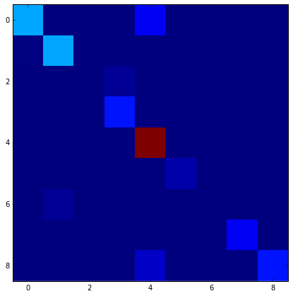
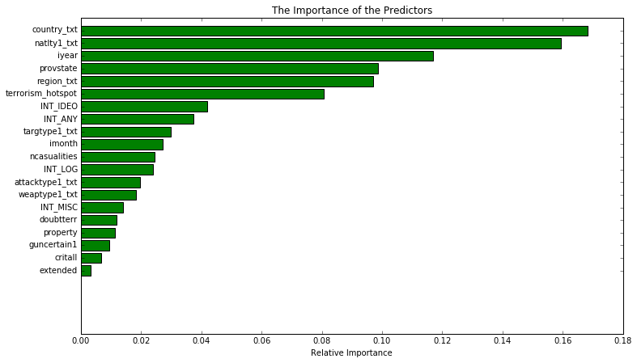

# GTD prediction model
Use attack type, weapons used, description of the attack, etc. to build a model that can predict what group may have been responsible for an incident.

* The prediction model used: random forest classifier
* special feature: spatial clustering to identify terrorism hotspots
    * terrorism can crop in regions that are not well described by borders
    * used latitude and longitude of attacks to identify high density areas of attacks
    * assigned every attack to a hotspot
* data selection: 
    * did not use 30% or greater missing features
    * combined parameters to reduce feature space
* memory workarounds:
    * predictive model iterated on subsets of data
    * optimized tree depth

  


```python
# Load the library with the iris dataset
from sklearn.datasets import load_iris
# Load scikit's random forest classifier library
from sklearn.ensemble import RandomForestClassifier
from sklearn.metrics import confusion_matrix
# Load pandas
import pandas as pd
# Load numpy
import numpy as np
# Set random seed
np.random.seed(0)
from sklearn.preprocessing import Imputer
from sklearn.metrics import accuracy_score
import matplotlib.pyplot as plt 
%matplotlib inline
```


```python
mycol=pd.read_csv("rawdata/col_index.txt",delim_whitespace=1)
myindex=list(np.array([int(i) for i in list(mycol)])-1)+[13,14] #add latitude longitude
```


```python
df = pd.read_csv("rawdata/globalterrorismdb_0617dist.csv",encoding='ISO-8859-1',usecols=myindex)
```

# Data Inspection and Cleaning

## a) convert datatypes to category, numeric, integer 


```python
convert_to_cat=["extended",
                "country_txt","region_txt","provstate",
                "crit1","crit2","crit3","doubtterr",
                "suicide","attacktype1_txt","targtype1_txt","natlty1_txt",
                "gname","guncertain1","individual","weaptype1_txt",
               "property","ishostkid",
                "INT_LOG","INT_IDEO","INT_MISC","INT_ANY"]


convert_to_float=["extended","nkill","nwound","latitude","longitude"]
```


```python
df[['iday', 'imonth','iyear']] = df[['iday', 'imonth','iyear']].astype(int)

for thecol in convert_to_cat:
    df[thecol]=df[thecol].astype('category')
for thecol in convert_to_float:
    df[thecol]=df[thecol].astype(float)
```

## b) calculate new columns from data


```python
df["datetime"]=pd.to_datetime(df["iday"],df["imonth"],df["iyear"])
df=df.drop('iday',axis=1)
```


```python
#df['imonth']=df['imonth'].astype('category')
#df['iyear']=df['iyear'].astype('category')
```


```python
df['nwound'].fillna(0).astype(int)
df['nkill'].fillna(0).astype(int)
df['ncasualities']=df['nkill']+df['nwound']
df=df.drop(['nwound','nkill'], axis=1)
```

## c) summarize data


```python
dfsumcat=df.describe(include=['category'])
dfsumcat.iloc[:,0:10]
```


<div>
<table border="1" class="dataframe">
  <thead>
    <tr style="text-align: right;">
      <th></th>
      <th>country_txt</th>
      <th>region_txt</th>
      <th>provstate</th>
      <th>crit1</th>
      <th>crit2</th>
      <th>crit3</th>
      <th>doubtterr</th>
      <th>suicide</th>
      <th>attacktype1_txt</th>
      <th>targtype1_txt</th>
    </tr>
  </thead>
  <tbody>
    <tr>
      <th>count</th>
      <td>170350</td>
      <td>170350</td>
      <td>155848</td>
      <td>170350</td>
      <td>170350</td>
      <td>170350</td>
      <td>170350</td>
      <td>170350</td>
      <td>170350</td>
      <td>170350</td>
    </tr>
    <tr>
      <th>unique</th>
      <td>205</td>
      <td>12</td>
      <td>2494</td>
      <td>2</td>
      <td>2</td>
      <td>2</td>
      <td>3</td>
      <td>2</td>
      <td>9</td>
      <td>22</td>
    </tr>
    <tr>
      <th>top</th>
      <td>Iraq</td>
      <td>Middle East &amp; North Africa</td>
      <td>Baghdad</td>
      <td>1</td>
      <td>1</td>
      <td>1</td>
      <td>0</td>
      <td>0</td>
      <td>Bombing/Explosion</td>
      <td>Private Citizens &amp; Property</td>
    </tr>
    <tr>
      <th>freq</th>
      <td>22130</td>
      <td>46511</td>
      <td>7238</td>
      <td>168381</td>
      <td>169155</td>
      <td>149877</td>
      <td>129942</td>
      <td>164580</td>
      <td>83073</td>
      <td>39994</td>
    </tr>
  </tbody>
</table>
</div>


```python
dfsumcat.iloc[:,10:20]
```


<div>
<table border="1" class="dataframe">
  <thead>
    <tr style="text-align: right;">
      <th></th>
      <th>natlty1_txt</th>
      <th>gname</th>
      <th>guncertain1</th>
      <th>individual</th>
      <th>weaptype1_txt</th>
      <th>property</th>
      <th>ishostkid</th>
      <th>INT_LOG</th>
      <th>INT_IDEO</th>
      <th>INT_MISC</th>
    </tr>
  </thead>
  <tbody>
    <tr>
      <th>count</th>
      <td>168956</td>
      <td>170350</td>
      <td>169971</td>
      <td>170350</td>
      <td>170350</td>
      <td>170350</td>
      <td>170172</td>
      <td>170350</td>
      <td>170350</td>
      <td>170350</td>
    </tr>
    <tr>
      <th>unique</th>
      <td>213</td>
      <td>3454</td>
      <td>2</td>
      <td>2</td>
      <td>12</td>
      <td>3</td>
      <td>3</td>
      <td>3</td>
      <td>3</td>
      <td>3</td>
    </tr>
    <tr>
      <th>top</th>
      <td>Iraq</td>
      <td>Unknown</td>
      <td>0</td>
      <td>0</td>
      <td>Explosives/Bombs/Dynamite</td>
      <td>1</td>
      <td>0</td>
      <td>-9</td>
      <td>-9</td>
      <td>0</td>
    </tr>
    <tr>
      <th>freq</th>
      <td>21625</td>
      <td>78306</td>
      <td>155633</td>
      <td>169927</td>
      <td>86704</td>
      <td>90019</td>
      <td>157411</td>
      <td>87497</td>
      <td>87629</td>
      <td>149964</td>
    </tr>
  </tbody>
</table>
</div>


```python
dfsumnum=df.describe(include=[np.number])
dfsumnum
```


<div>
<table border="1" class="dataframe">
  <thead>
    <tr style="text-align: right;">
      <th></th>
      <th>eventid</th>
      <th>iyear</th>
      <th>imonth</th>
      <th>extended</th>
      <th>latitude</th>
      <th>longitude</th>
      <th>ncasualities</th>
    </tr>
  </thead>
  <tbody>
    <tr>
      <th>count</th>
      <td>1.703500e+05</td>
      <td>170350.000000</td>
      <td>170350.000000</td>
      <td>170350.000000</td>
      <td>165744.000000</td>
      <td>165744.000000</td>
      <td>154524.000000</td>
    </tr>
    <tr>
      <th>mean</th>
      <td>2.001776e+11</td>
      <td>2001.709997</td>
      <td>6.474365</td>
      <td>0.043634</td>
      <td>23.399774</td>
      <td>26.350909</td>
      <td>5.312327</td>
    </tr>
    <tr>
      <th>std</th>
      <td>1.314444e+09</td>
      <td>13.144146</td>
      <td>3.392364</td>
      <td>0.204279</td>
      <td>18.844885</td>
      <td>58.570068</td>
      <td>40.798412</td>
    </tr>
    <tr>
      <th>min</th>
      <td>1.970000e+11</td>
      <td>1970.000000</td>
      <td>0.000000</td>
      <td>0.000000</td>
      <td>-53.154613</td>
      <td>-176.176447</td>
      <td>0.000000</td>
    </tr>
    <tr>
      <th>25%</th>
      <td>1.990053e+11</td>
      <td>1990.000000</td>
      <td>4.000000</td>
      <td>0.000000</td>
      <td>11.263580</td>
      <td>2.396199</td>
      <td>0.000000</td>
    </tr>
    <tr>
      <th>50%</th>
      <td>2.007121e+11</td>
      <td>2007.000000</td>
      <td>6.000000</td>
      <td>0.000000</td>
      <td>31.472680</td>
      <td>43.130000</td>
      <td>1.000000</td>
    </tr>
    <tr>
      <th>75%</th>
      <td>2.014023e+11</td>
      <td>2014.000000</td>
      <td>9.000000</td>
      <td>0.000000</td>
      <td>34.744167</td>
      <td>68.451297</td>
      <td>4.000000</td>
    </tr>
    <tr>
      <th>max</th>
      <td>2.017013e+11</td>
      <td>2016.000000</td>
      <td>12.000000</td>
      <td>1.000000</td>
      <td>74.633553</td>
      <td>179.366667</td>
      <td>8749.000000</td>
    </tr>
  </tbody>
</table>
</div>


### missing data analysis


```python
df.isnull().sum()/len(df)<0.30 #make sure at least 70 percent of data is present!
#terror_data['injuries'] = terror_data['injuries'].fillna(0).astype(int)
df.isnull().sum()/len(df)
```


    eventid            0.000000
    iyear              0.000000
    imonth             0.000000
    extended           0.000000
    country_txt        0.000000
    region_txt         0.000000
    provstate          0.085131
    latitude           0.027038
    longitude          0.027038
    crit1              0.000000
    crit2              0.000000
    crit3              0.000000
    doubtterr          0.000000
    suicide            0.000000
    attacktype1_txt    0.000000
    targtype1_txt      0.000000
    natlty1_txt        0.008183
    gname              0.000000
    guncertain1        0.002225
    individual         0.000000
    weaptype1_txt      0.000000
    property           0.000000
    ishostkid          0.001045
    INT_LOG            0.000000
    INT_IDEO           0.000000
    INT_MISC           0.000000
    INT_ANY            0.000000
    datetime           0.000000
    ncasualities       0.092903
    dtype: float64


## d)  Data Imputation


```python
col_many_cat=df.select_dtypes(include=['category']).apply(lambda x: len(x.unique())>12)
#1. data has many categories: label na data as missing
df_cat_hi=df.select_dtypes(include=['category']).ix[:,col_many_cat==True] 
df_cat_hi=df_cat_hi.apply(lambda x: x.cat.add_categories(['missing']).fillna('missing'))
#2  data has few categories:impute na data as most frequent
df_cat_lw=df.select_dtypes(include=['category']).ix[:,col_many_cat==False] 
df_cat_lw=df_cat_lw.apply(lambda x:x.fillna(x.value_counts().index[0]))
```


```python
#3  data is numerical:impute na data as median (some of the data is skewed)
df_num=df[["extended","ncasualities","iyear","imonth","latitude","longitude"]].apply(lambda x:x.fillna(x.median()))
```


```python
df = pd.concat([df_num,df_cat_hi,df_cat_lw],axis=1)
```


```python
df.isnull().sum()/len(df)
```


    extended           0
    ncasualities       0
    iyear              0
    imonth             0
    latitude           0
    longitude          0
    country_txt        0
    provstate          0
    targtype1_txt      0
    natlty1_txt        0
    gname              0
    region_txt         0
    crit1              0
    crit2              0
    crit3              0
    doubtterr          0
    suicide            0
    attacktype1_txt    0
    guncertain1        0
    individual         0
    weaptype1_txt      0
    property           0
    ishostkid          0
    INT_LOG            0
    INT_IDEO           0
    INT_MISC           0
    INT_ANY            0
    dtype: float64


# modify data 


```python
df["ncasualities"]=list(np.log10(np.array((df["ncasualities"]))+1))
setcrit=zip(list(df["crit1"]),list(df["crit2"]),list(df["crit3"]))
```


```python
df["critall"]=[str(s[0])+str(s[1])+str(s[2]) for s in setcrit]
```


```python
df['critall']=df['critall'].astype('category')
```

# Identify Spatial Terrorism Hot Zones 


```python
from sklearn.cluster import DBSCAN
```


```python
from geopy.distance import great_circle
```


```python
from shapely.geometry import MultiPoint
```


```python
# Define coordinates 
coords = df.as_matrix(columns=['latitude', 'longitude'])
```


```python
subcoords=coords
```


```python
kms_per_radian = 6371.0088 #haversine needs radians
epsilon = 160 / kms_per_radian # otherwise outside of cluster (100 miles)
db = DBSCAN(eps=epsilon, min_samples=1, algorithm='ball_tree', metric='haversine').fit(np.radians(subcoords))
```


```python
cluster_labels = db.labels_
num_clusters = len(set(cluster_labels))
clusters = pd.Series([subcoords[cluster_labels == n] for n in range(num_clusters)])
print('Number of clusters: {}'.format(num_clusters))
```

    Number of clusters: 456


```python
df["terrorism_hotspot"]=list(cluster_labels)
```


```python
df["terrorism_hotspot"]=df["terrorism_hotspot"].astype('category')
```

### e) refine model and drop columns that are adding noise


```python
df=df.drop(["individual","crit1","suicide","ishostkid","latitude","longitude","crit2","crit3"],axis=1)
```

# Create Training and Testing Data Sets

### a. splice out data that has no group assigned to the attack


```python
dfgu=df.ix[df['gname']=='Unknown',:] #group unknown
dfgk=df.ix[df['gname']!='Unknown',:]#group known
```


```python
len(df)==len(dfgu)+len(dfgk) #check that this is all the data
```


    True


### b. factorize categorical data


```python
# Create a list of the feature column's names
dfgk_cat=dfgk.select_dtypes(include=['category']).apply(lambda x: pd.factorize(x)[0])

```


```python
dfgk_num=dfgk.select_dtypes(exclude=['category'])
dfgk_fac = pd.concat([dfgk_cat,dfgk_num], axis=1)
```

### c. split data training and test  sets


```python
# randomly label some rows as training and some as test data.
dfgk_fac['is_train'] = np.random.uniform(0, 1, len(dfgk_fac)) <= .70 #is train? 1/0 (75% training)

```


```python
train, test = dfgk_fac[dfgk_fac['is_train']==True], dfgk_fac[dfgk_fac['is_train']==False]
```


```python
# Show the number of observations
train=train.drop("is_train",axis=1)
test=test.drop("is_train",axis=1)
print('total attacks in the training data:', len(train))
print('total attacks in the test data:',len(test))

```

    ('total attacks in the training data:', 64466)
    ('total attacks in the test data:', 27578)


```python
y=train["gname"]
```


```python
# Create a list of the feature column's names
features = train.drop('gname',axis=1).columns[:]
```

# Train Model


```python
# generated a random forest classifer (clf)
clf = RandomForestClassifier(n_jobs=4,max_depth=15,random_state=0,warm_start=False,oob_score=False,n_estimators=30)
# training the classifer on the terrorist group names
clf.fit(train[features],y)
```


    RandomForestClassifier(bootstrap=True, class_weight=None, criterion='gini',
                max_depth=15, max_features='auto', max_leaf_nodes=None,
                min_samples_leaf=1, min_samples_split=2,
                min_weight_fraction_leaf=0.0, n_estimators=30, n_jobs=4,
                oob_score=False, random_state=0, verbose=0, warm_start=False)


# Test Model on Data Piecewise to Avoid Memory Issues

### test subset of training data

pull of a subset 


```python
len(test)
```


    27578


```python
div20=27500
mytest=test.iloc[0:div20]
```

write function that will predict given index of attack


```python
def predset(index_attack):
    return clf.predict(mytest[features].iloc[index_attack,:])
```

create an index set for attacks (20 in each)


```python
mysets=np.reshape(np.arange(0,div20),(div20/20,20)) #test 20 at a time
preds=np.zeros(div20)
```

have the model predict the group responsible


```python
for set_index in mysets:
    preds[set_index]=predset(set_index)
```

see how accurate the predictions were

# Evaluate Model


```python
accuracy = accuracy_score(mytest['gname'], preds)
```


```python
accuracy
```


    0.79487272727272729


```python
# Create confusion matrix
#conf=pd.crosstab(mytest['gname'], preds, rownames=['Actual Group Name'], colnames=['Predicted Group Name'])
plt.rcParams['figure.figsize'] = [12, 7]
conf = confusion_matrix(mytest['gname'],preds)
plt.imshow(conf[1:10,1:10],interpolation='None',)

```


    <matplotlib.image.AxesImage at 0x7f53f9b1d910>





```python
#list(zip(train[features], clf.feature_importances_))
```


```python
importances = clf.feature_importances_
findex = np.argsort(importances)
plt.rcParams['figure.figsize'] = [12, 7]
plt.figure(1)
plt.title('The Importance of the Predictors')
plt.barh(range(len(findex)), importances[findex], color='g', align='center')
plt.yticks(range(len(findex)), features[findex])
plt.xlabel('Relative Importance')
```


    <matplotlib.text.Text at 0x7f53fa19b510>





#### Hack to Give us OOB score


```python
# generated a random forest classifer (clf)
clf = RandomForestClassifier(n_jobs=4,max_depth=15,random_state=0,warm_start=True,oob_score=True,n_estimators=1)
# training the classifer on the terrorist group names
clf.fit(train[features].iloc[0:2000],y[0:2000])
```

    /home/ej/anaconda2/lib/python2.7/site-packages/sklearn/ensemble/forest.py:403: UserWarning: Some inputs do not have OOB scores. This probably means too few trees were used to compute any reliable oob estimates.
      warn("Some inputs do not have OOB scores. "


    RandomForestClassifier(bootstrap=True, class_weight=None, criterion='gini',
                max_depth=15, max_features='auto', max_leaf_nodes=None,
                min_samples_leaf=1, min_samples_split=2,
                min_weight_fraction_leaf=0.0, n_estimators=1, n_jobs=4,
                oob_score=True, random_state=0, verbose=0, warm_start=True)


```python
1-clf.oob_score_
```


    0.79600000000000004


This is close to what we found when we tested our model on data it had never seen before.


```python

```


```python

```
